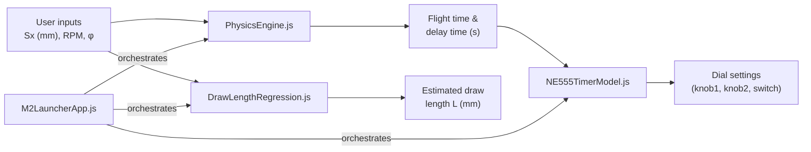

# M2 Ball Launcher — Project Context & Plan

## 1. Project Overview

The **M2 Ball Launcher** is an engineering project developed at **King Mongkut's University of Technology Thonburi (KMUTT)**. It is a mechanical ball launcher that fires a projectile at a fixed angle (60°) and uses an **NE555 timer circuit** to control the trigger delay so that the ball lands at a precise horizontal distance.

The software is a **single-page web application** (HTML/CSS/JS) built with **OOP principles** using ES6 modules. It provides:

1. **Delay calculator** — compute flight time, trigger delay, and NE555 dial/knob settings.
2. **Draw-length regression** — estimate draw length (L) from landing distance (Sx) via OLS linear inversion.

> [!NOTE]
> The delay calculator applies a **+102 mm offset** to the user's Sx input before computing physics (i.e., `Sx_delay = Sx_input + 102`). The regression uses the raw Sx input directly.

---

## 2. System Architecture



### File Structure

```
├── index.html                        ← HTML structure (no inline JS)
├── style.css                         ← Stylesheet (light theme)
├── js/
│   ├── main.js                       ← Entry point (boots the app)
│   ├── NE555TimerModel.js            ← CSV loading, regression, step lookup
│   ├── PhysicsEngine.js              ← Projectile kinematics, delay computation
│   ├── DrawLengthRegression.js       ← OLS linear fit, algebraic inversion
│   └── M2LauncherApp.js              ← Orchestrator, DOM rendering
├── Example/
│   ├── ne555_full_dataset.csv        ← NE555 calibration data (loaded at runtime)
│   ├── delay.py                      ← Original Python delay calculator (reference)
│   ├── regression.py                 ← Original Python regression tool (reference)
│   ├── ne555_calculator.html         ← Original standalone HTML calculator (reference)
│   ├── Experiment3_Analysis_Summary_updated.csv
│   └── Experiment3_Summary.xlsx
└── project_context.md                ← This file
```

### End-to-End Pipeline

| Step | Input | Module | Output |
|------|-------|--------|--------|
| 1 | Sx (mm), RPM, φ (deg) | `PhysicsEngine` | Flight time (s), delay time (s) — uses Sx + 102 mm |
| 2 | t_delay (s) | `NE555TimerModel` | Best dial step, knob/switch decomposition |
| 3 | Sx (mm) | `DrawLengthRegression` | Estimated draw length L (mm) — uses raw Sx |

---

## 3. Module Breakdown

### 3.1 Physics Engine — [PhysicsEngine.js](js/PhysicsEngine.js)

Handles projectile kinematics for a launcher firing at a fixed elevation angle.

#### Key Parameters (Defaults)

| Parameter | Symbol | Default | Unit | Description |
|-----------|--------|---------|------|-------------|
| `sy` | Sy | 0.036 | m | Vertical offset of landing surface |
| `launchAngleDeg` | θ | 60.0 | ° | Fixed launch angle |
| `g` | g | 9.81 | m/s² | Gravitational acceleration |
| `armRadius` | r | 0.06 | m | Arm radius for arcsin constant |
| `armPivot` | — | 2.5 | m | Arm pivot distance |
| `sxOffset` | — | 102 | mm | Offset added to Sx for delay calc |

#### Core Equations

**Flight time** (from horizontal range equation):

$$t_{flight} = \sqrt{\frac{2\,(S_x \tan\theta - S_y)}{g}}$$

**Angular velocity** of the motor:

$$\omega = RPM \times \frac{\pi}{30}$$

**Geometric constant** c:

$$c = \arcsin\!\left(\frac{r_{arm}}{d_{pivot} - S_x}\right)$$

**Raw delay time**:

$$t_{delay} = \frac{2\pi - \varphi - c}{\omega} - t_{flight}$$

> [!IMPORTANT]
> If `t_delay < 0`, one full cycle (2π/ω) is added. A hardware minimum of **0.1 s** is enforced — if still below 0.1 s after adding a cycle, an error is thrown.

#### Public API

| Method | Signature | Returns |
|--------|-----------|---------|
| `computeFlightTime` | `(sxM: number) → number` | Flight time in seconds |
| `computeDelayTime` | `(sxMm, rpm, phiDeg) → object` | `{tFlight, tDelayRaw, tDelay, cycleAdded, omega, cConst, sxUsed}` |

---

### 3.2 Draw Length Regression — [DrawLengthRegression.js](js/DrawLengthRegression.js)

OLS linear regression in the natural direction (L → Sx) with algebraic inversion (Sx → L).

#### Calibration Data (Built-in)

| Draw Length L (mm) | Mean Sx (mm) |
|--------------------|-------------|
| 105 | 1548.07 |
| 110 | 1657.67 |
| 115 | 1783.74 |
| 120 | 1946.85 |
| 125 | 2067.23 |
| 130 | 2199.73 |

#### Regression Model

Only the **linear** fit is used (OLS natural direction + algebraic inversion):

$$Sx = a \cdot L + b \qquad \Rightarrow \qquad L = \frac{Sx - b}{a}$$

> [!NOTE]
> The algebraic inversion of the natural fit is the statistically correct approach since L (draw length) is the controlled variable and Sx (landing distance) carries measurement noise.

#### Public API

| Method | Signature | Returns |
|--------|-----------|---------|
| `predictForward` | `(L: number) → number` | Predicted landing Sx (mm) |
| `invertLinear` | `(Sx: number) → number` | Estimated draw length L (mm) |
| `isInRange` | `(Sx: number) → boolean` | Whether Sx is within calibrated range |
| `equationStrings` | `() → {forward, inverse}` | Formatted equation strings |

---

### 3.3 NE555 Timer Model — [NE555TimerModel.js](js/NE555TimerModel.js)

Calibration model for the NE555 timer circuit that controls the trigger delay.

#### Hardware Constants

| Constant | Value | Description |
|----------|-------|-------------|
| `THRESHOLD` | 10.0 s | Switch adds 10 s to effective range |
| `MIN_STEP` | 0.1 | Minimum dial step |
| `MAX_STEP` | 19.0 | Maximum dial step |
| `STEP_INC` | 0.1 | Step increment |

#### Data Source

- Loads from `Example/ne555_full_dataset.csv` via `fetch()` at runtime.
- Rows marked `n_readings == "PREDICTED"` are excluded from regression training.
- Outliers with `std_s ≥ 0.1` are filtered before fitting.
- Falls back to hardcoded slope/intercept if CSV is unavailable.

#### Dial Decomposition

A dial step (0.1–19.0) is decomposed into physical settings:

| Field | Description |
|-------|-------------|
| `switchOn` | `true` if step ≥ 10.0 (toggle the +10 s switch) |
| `effective` | Step minus 10 if switch is on |
| `knob2` | Integer part of effective step |
| `knob1` | Tenths digit (0–9) |

#### Public API

| Method | Signature | Returns |
|--------|-----------|---------|
| `loadCSV` | `(...paths) → Promise<void>` | Load and parse CSV data |
| `ne555Output` | `(step: number) → number` | Predicted output time (s) |
| `bestStep` | `(tDelay: number) → number` | Closest dial step to target delay |
| `decomposeStep` | `(step: number) → object` | Knob/switch settings + NE555 stats |

---

### 3.4 M2 Launcher App — [M2LauncherApp.js](js/M2LauncherApp.js)

Orchestrator that composes the three engine classes and renders results to the DOM.

#### Responsibilities

- Instantiates `NE555TimerModel`, `PhysicsEngine`, and `DrawLengthRegression`.
- Binds input event listeners on the shared Sx/RPM/φ fields.
- Calls `PhysicsEngine.computeDelayTime()` → `NE555TimerModel.bestStep()` → renders delay output.
- Calls `DrawLengthRegression.invertLinear()` → renders regression output.

#### Public API

| Method | Signature | Description |
|--------|-----------|-------------|
| `init` | `() → Promise<void>` | Load data, bind events, initial render |
| `update` | `() → void` | Re-run both calculators from current inputs |

---

## 4. Technology Stack

| Layer | Technology | Purpose |
|-------|-----------|---------|
| Structure | HTML5 | Semantic page layout |
| Styling | Vanilla CSS | Light theme matching original knob calculator |
| Logic | ES6 JavaScript Modules | OOP classes with `import`/`export` |
| Fonts | Google Fonts (JetBrains Mono, DM Sans) | Monospace + sans-serif typography |
| Data | CSV (fetched at runtime) | NE555 calibration measurements |

> [!IMPORTANT]
> ES6 modules require a web server — `file://` won't work due to CORS. Run with:
> ```
> python -m http.server 8080
> ```
> Then open `http://localhost:8080`.

---

## 5. Data Files

| File | Location | Description |
|------|----------|-------------|
| `ne555_full_dataset.csv` | `Example/` | NE555 calibration measurements (target time, mean output, std, n_readings) |
| `Experiment3_Analysis_Summary_updated.csv` | `Example/` | Draw-length experiment raw data |
| `Experiment3_Summary.xlsx` | `Example/` | Draw-length experiment summary |

---

## 6. Potential Next Steps

- [ ] **Unit tests** — Validate physics calculations, regression accuracy, and edge cases (e.g. using a JS test framework).
- [ ] **Configuration file** — Externalise hardware constants (launch angle, arm dimensions, offsets) into a JSON config.
- [ ] **Error propagation** — Propagate σ_Sx uncertainty through the physics pipeline to report confidence intervals on t_delay.
- [ ] **Additional calibration data** — Extend the draw-length range beyond 105–130 mm.
- [ ] **GitHub Pages deployment** — Host the app via GitHub Pages for easy browser access.
