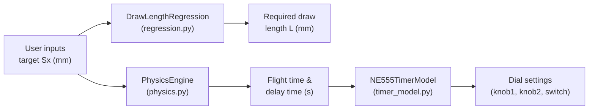

# M2 Ball Launcher — Project Context & Plan

## 1. Project Overview

The **M2 Ball Launcher** is an engineering project developed at **King Mongkut's University of Technology Thonburi (KMUTT)**. It is a mechanical ball launcher that fires a projectile at a fixed angle (60°) and uses an **NE555 timer circuit** to control the trigger delay so that the ball lands at a precise horizontal distance.

The software layer provides three core capabilities:

1. **Projectile physics** — compute flight time and required trigger delay.
2. **Draw-length regression** — map between draw length (L) and landing distance (Sx).
3. **NE555 timer calibration** — translate a computed delay time into physical dial/knob settings on the hardware.

---

## 2. System Architecture

### End-to-End Pipeline

| Step | Input | Module | Output |
|------|-------|--------|--------|
| 1 | Target landing distance Sx (mm) | `DrawLengthRegression` | Required draw length L (mm) |
| 2 | Sx (mm), motor RPM, phase angle φ | `PhysicsEngine` | Flight time t_flight (s), delay time t_delay (s) |
| 3 | t_delay (s) | `NE555TimerModel` | Best dial step, knob/switch decomposition |

---

## 3. Module Breakdown

### 3.1 Physics Engine — [physics.py](file:///c:/Users/User/OneDrive%20-%20King%20Mongkut's%20University%20of%20Technology%20Thonburi%20(KMUTT)/stu/m2_launcher/physics.py)

Handles projectile kinematics for a launcher firing at a fixed elevation angle.

#### Key Parameters (Defaults)

| Parameter | Symbol | Default | Unit | Description |
|-----------|--------|---------|------|-------------|
| `sy` | Sy | 0.036 | m | Vertical offset of landing surface |
| `launch_angle_deg` | θ | 60.0 | ° | Fixed launch angle |
| `g` | g | 9.81 | m/s² | Gravitational acceleration |
| `arm_radius` | r | 0.06 | m | Arm radius for arcsin constant |
| `arm_pivot` | — | 2.5 | m | Arm pivot distance |

#### Core Equations

**Flight time** (from horizontal range equation):

$$t_{flight} = \sqrt{\frac{2\,(S_x \tan\theta - S_y)}{g}}$$

**Angular velocity** of the motor:

$$\omega = RPM \times \frac{\pi}{30}$$

**Geometric constant** c:

$$c = \arcsin\!\left(\frac{r_{arm}}{d_{pivot} - S_x}\right)$$

**Raw delay time**:

$$t_{delay} = \frac{2\pi - \varphi - c}{\omega} - t_{flight}$$

> [!IMPORTANT]
> If `t_delay < 0`, one full cycle (2π/ω) is added. A hardware minimum of **0.1 s** is enforced — if still below 0.1 s after adding a cycle, a `ValueError` is raised.

#### Public API

| Method | Signature | Returns |
|--------|-----------|---------|
| `compute_flight_time` | `(sx_m: float) → float` | Flight time in seconds |
| `compute_delay_time` | `(sx_mm, rpm, phi_deg) → dict` | `{t_flight, t_delay_raw, t_delay, cycle_added, omega, c_const}` |

---

### 3.2 Draw Length Regression — [regression.py](file:///c:/Users/User/OneDrive%20-%20King%20Mongkut's%20University%20of%20Technology%20Thonburi%20(KMUTT)/stu/m2_launcher/regression.py)

OLS polynomial regression mapping draw length (L) to landing distance (Sx) and vice versa.

#### Calibration Data (Built-in Defaults)

| Draw Length L (mm) | Mean Sx (mm) | σ Sx (mm) |
|--------------------|-------------|-----------|
| 105 | 1548.07 | 15.67 |
| 110 | 1657.67 | 17.58 |
| 115 | 1783.74 | 42.59 |
| 120 | 1946.85 | 35.89 |
| 125 | 2067.23 | 43.36 |
| 130 | 2199.73 | 36.25 |

#### Regression Models

Three fitting modes are supported:

| Mode | Direction | Description |
|------|-----------|-------------|
| **Natural** | L → Sx | OLS fit treating L as error-free (✓ statistically correct) |
| **Direct inverse** | Sx → L | Convenience polyfit swapping axes |
| **Algebraic inversion** | Sx → L (via natural) | Inverts the natural fit algebraically (recommended) |

Each mode provides both **linear** and **quadratic** polynomial fits.

#### Public API

| Method | Direction | Degree |
|--------|-----------|--------|
| `predict_forward_linear` / `predict_forward_quadratic` | L → Sx | 1 / 2 |
| `predict_direct_linear` / `predict_direct_quadratic` | Sx → L (direct) | 1 / 2 |
| `invert_linear` / `invert_quadratic` | Sx → L (algebraic) | 1 / 2 |
| `metrics(y_true, y_pred)` | — | RMSE & R² |
| `equation_strings(mode)` | — | Formatted equations |
| `mode_metrics(mode)` | — | Full metrics dict |

> [!NOTE]
> The **algebraic inversion of the natural fit** is the statistically recommended approach for Sx → L estimation, since L (draw length) is the controlled variable and Sx (landing distance) carries measurement noise.

---

### 3.3 NE555 Timer Model — [timer_model.py](file:///c:/Users/User/OneDrive%20-%20King%20Mongkut's%20University%20of%20Technology%20Thonburi%20(KMUTT)/stu/m2_launcher/timer_model.py)

Calibration model for the NE555 timer circuit that controls the trigger delay.

#### Hardware Constants

| Constant | Value | Description |
|----------|-------|-------------|
| `THRESHOLD` | 10.0 s | Switch adds 10 s to effective range |
| `MIN_STEP` | 0.1 | Minimum dial step |
| `MAX_STEP` | 19.0 | Maximum dial step |
| `STEP_INC` | 0.1 | Step increment |

#### Data Source

- Loads from `data/ne555_full_dataset.csv` (bundled alongside the module).
- Rows marked `n_readings == "PREDICTED"` are excluded from regression training.
- Outliers with `std_s ≥ 0.1` are filtered before fitting.

#### Fitting

A **simple linear regression** (scikit-learn `LinearRegression`) is fitted:

$$\text{mean\_output} = \text{slope} \times \text{target\_time} + \text{intercept}$$

Recorded measurements are stored in a lookup dict and preferred over the regression estimate when available.

#### Dial Decomposition

A dial step (0.1–19.0) is decomposed into physical settings:

| Field | Description |
|-------|-------------|
| `switch_on` | `True` if step ≥ 10.0 (toggle the +10 s switch) |
| `effective` | Step minus 10 if switch is on |
| `knob2` | Integer part of effective step |
| `knob1` | Tenths digit (0–9) |

#### Public API

| Method | Signature | Returns |
|--------|-----------|---------|
| `ne555_output` | `(step: float) → float` | Predicted output time (s) |
| `best_step` | `(t_delay: float) → float` | Closest dial step to target delay |
| `decompose_step` | `(step: float) → dict` | Knob/switch settings + NE555 stats |
| `to_json` | `() → str` | Recorded lookup as JSON string |

---

## 4. Dependencies

| Package | Used By | Purpose |
|---------|---------|---------|
| `numpy` | `regression.py`, `timer_model.py` | Array math, `polyfit`, `polyval` |
| `pandas` | `timer_model.py` | CSV loading |
| `scikit-learn` | `timer_model.py` | `LinearRegression` |
| `math` (stdlib) | `physics.py` | Trig functions |
| `json` (stdlib) | `timer_model.py` | JSON serialisation |

---

## 5. Data Files

| File | Location | Description |
|------|----------|-------------|
| `ne555_full_dataset.csv` | `m2_launcher/data/` | NE555 calibration measurements (target time, mean output, std, n_readings) |

> [!WARNING]
> The CSV file is expected at `data/ne555_full_dataset.csv` relative to `timer_model.py`. If the file is missing, `NE555TimerModel.__init__` will raise `FileNotFoundError`.

---

## 6. Potential Next Steps

These are observations based on the current codebase — not committed work:

- [ ] **GUI / Web dashboard** — A Streamlit or HTML dashboard to let users input Sx and get dial settings interactively.
- [ ] **Unified pipeline script** — A single `main.py` that chains all three modules end-to-end.
- [ ] **Plotting utilities** — Visualise regression fits, residuals, and NE555 calibration curves.
- [ ] **Unit tests** — Validate physics calculations, regression accuracy, and edge cases.
- [ ] **Configuration file** — Externalise hardware constants (launch angle, arm dimensions, NE555 thresholds) into a YAML/JSON config.
- [ ] **Error propagation** — Propagate σ_Sx uncertainty through the physics pipeline to report confidence intervals on t_delay.
- [ ] **Additional calibration data** — Extend the draw-length range beyond 105–130 mm.
